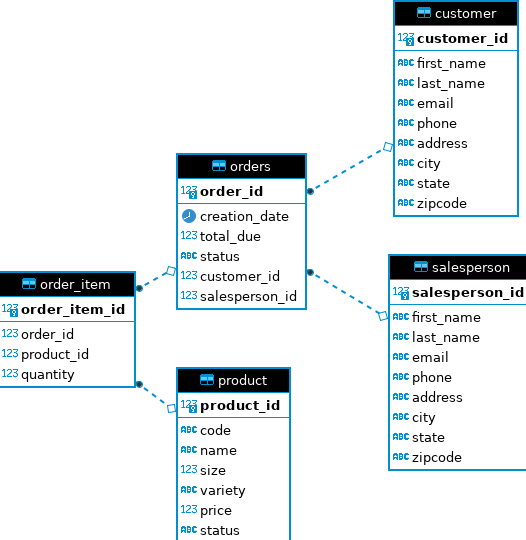

# Introduction 
The purpose of this application is to utilize the JDBC API is to execute queries on a PostgreSQL database that has been provisioned by Docker. Various 
CRUD(create, read, update, and delete) operations were performed on the database. The technologies utilized were Java, PostgreSQL, Docker, Maven, and DBeaver.

# Implementation 

## ER Diagram

# Design Patterns
In Java there are two accepted accepted design patterns used to access databases, Data Access Object (DAO) and the Repository design patterns. This project implemented
the DAO pattern. 

**DAO:** The Data Access Object (DAO) pattern is a structural pattern that allows us to isolate the application/business layer from the persistence 
layer (usually a relational database but could be any other persistence mechanism) using an abstract API. It executes transactions against a given database using CRUD
functionality. This abstract API can then be implemented to work with various objects which represent the data. 

**Repository Pattern:** In contrast to DAO, this design pattern sits at a higher level, closer to that of the business logic of the application. It is best to  
utilize this pattern if the database is highly normalized. This pattern focuses on single table access per class. 

# Test
Testing was done manually by specific methods written to execute the statements and display the results to verify the correct output. CRUDing was done on the test
data in the database. A new customer would be added, displayed, updated and then displayed again to ensure the updates were done correctly. 

