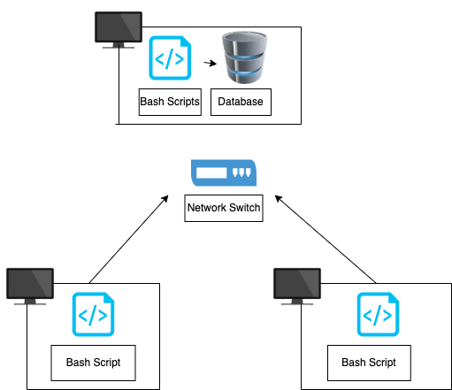

# Linux Cluster Monitoring Agent

# Introduction
The objective of the Linux Cluster Monitoring Agent is to record the hardware specifications of each node and monitor node resource usages (eg CPU/memory) in real time. The Linux Cluster Administration (LCA) team manages 10 nodes each running CentOS 7. The MVP is developed through the use of bash scripts, docker, postgreSQL, and git. The bash scripts are used to record data on each server and send it to the postreSQL database. The database is provisioned using docker and through the use of `crontab` at least 3 updates will be given in 5 minute intervals. This will assist the LCA team in decisions regarding allocating resources. 

# Quick Start

````
# Start/stopping the psql instance (provisioned using Docker)

./scripts/psql_docker.sh create postgres password
./scripts/psql_docker.sh start

# Create appropriate tables using ddl.sql.
psql -h localhost -U postgres -d host_agent -f sql/ddl.sql

# Insert hardware specs data into the database using host_info.sh. 
./scripts/host_info.sh localhost 5432 host_agent postgres password

# Insert hardware usage data into the database 
./scripts/host_usage.sh localhost 5432 host_agent postgres password

#Crontab setup (host_usage executes every minute).
* * * * * bash /pwd/scripts/host_usage.sh localhost 5432 host_usage postgres password > /tmp/host_usage.log
````

# Implementation 
A copy of `host_info.sh` and `host_usage.sh` is stored in each host/node. `host_info.sh` records the hardware specifications while `host_usage.sh` records the resource usage data. The data is then recorded into postgreSQL database called `host_agent`, which containts two tables `host_info` and `host_usage`. The resource usage data is collected every minute through the use of `crontab`. The database is provisioned using using Docker by creating a psql image and creating a volume (`pgdata`) to preserve data. 

# Architecture 


# Scripts
Below are the scripts used along with their description. 

- `psql_docker.sh`:
  - Provisions a PSQL instance using Docker 
  - Starts/stops the Docker container containing the PSQL instance.
  
  `./scripts/psql_docker.sh create|start|stop DB_USERNAME DB_PASSWORD`
 
- `host_usage.sh`:
  - collects host usage data 
  - Inserts data into the `host_agent` database, the `host_usage` table specifically 
  
  `./scripts/host_usage.sh HOST_NAME PSQL_PORT db_name db_username db_password`
 
- `host_info.sh`:
  - collects hardware info 
  - Inserts data into the `host_agent` database, the `host_info` table specifically
  
  `./scripts/host_info.sh HOST_NAME PSQL_PORT db_name db_username db_password`

- `crontab`
  - edit the crontab file with the path to the host_usage.sh script that will be executed every minute
  
  `* * * * * bash [path to host_usage.sh] HOST_NAME PSQL_PORT db_name db_username db_password > /tmp/host_usage.log`

- `queries.sql`
  - First Query: Group hosts by CPU number and sort by their memory size in descending order
  - Second Query: Average used memory in percentage over 5 mins interval for each host. 
  - Third Query: Checks whether the cron job has failed or not. If updated less than three times in a span of five minutes it is considered a failure. 

# Database Modeling

The two tables below show the schema for Host Info and Host Usage. 

### Host Info 
| NAME             | TYPE       | CONSTRAINT  |
|------------------|------------|-------------|
| id               | SERIAL     | Primary key |
| hostname         | VARCHAR    | not null    |
| cpu_number       | INT        | not null    |
| cpu_architecture | VARCHAR    | not null    |
| cpu_model        | VARCHAR    | not null    | 
| cpu_mhz          | FLOAT      | not null    | 
| l2_cache         | INT        | not null    |
| total_mem        | INT        | not null    |
| timestamp        | TIMESTAMP  | not null    |

### Host Usage 
| NAME           | TYPE      | CONSTRAINT                   |
|----------------|-----------|------------------------------|
| timestamp      | TIMESTAMP | not null                     |
| host_id        | INT       | Foreign Key (host_info.id)   |
| memory_free    | FLOAT     | not null                     |
| cpu_idle       | INT       | not null                     |
| cpu_kernel     | INT       | not null                     | 
| disk_io        | INT       | not null                     | 
| disk_available | FLOAT     | not null                     |

